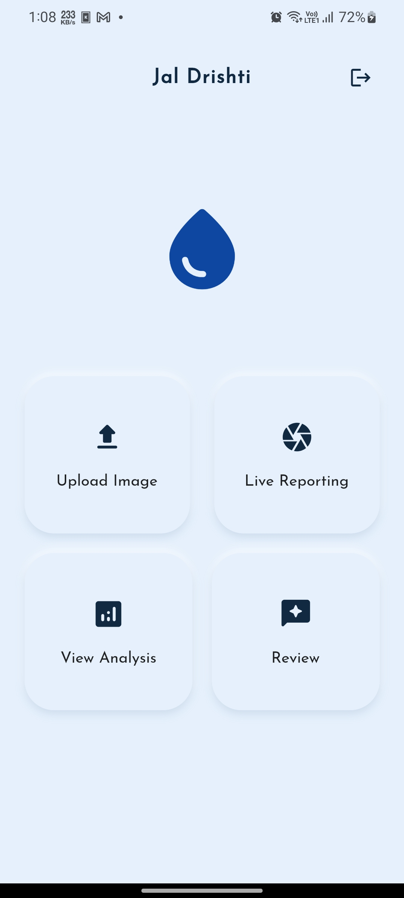
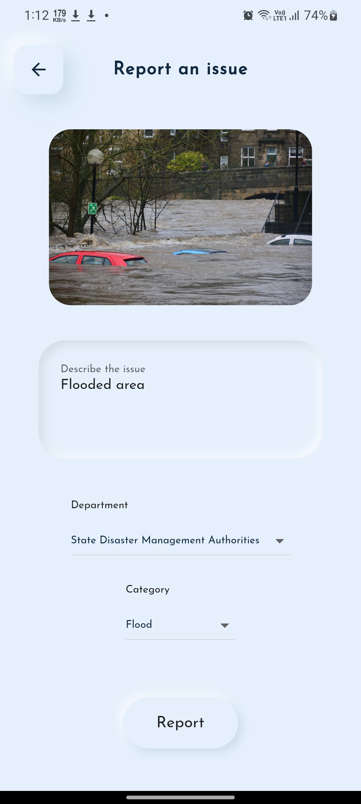
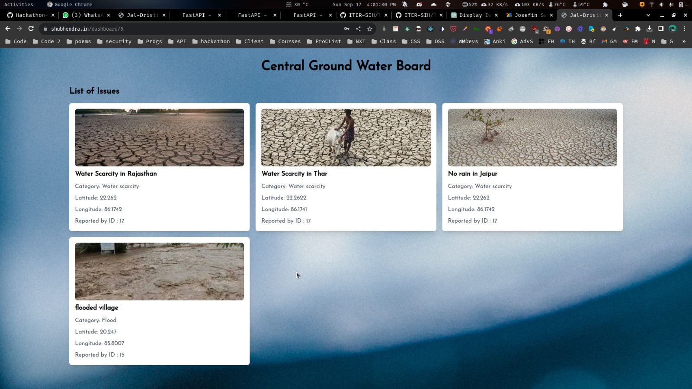
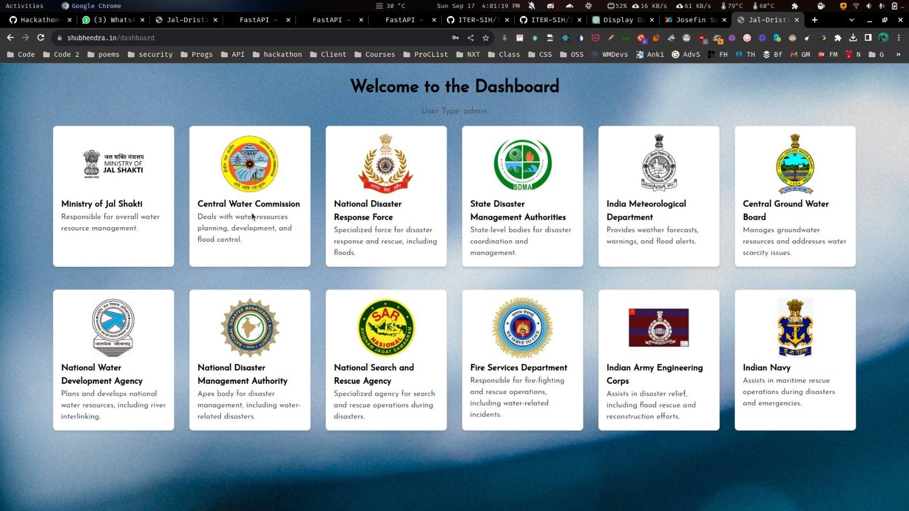

# Team-14

<p align="center">
  
</p>

<h1 align="center">JalDristi</h1>

<p align="center">
  <strong>A Comprehensive Water Crowdsourcing and Management Platform</strong>
</p>

<p align="center">
  <a href="LICENSE">
    
  </a>
  <a href="#">
    
  </a>
  <a href="#">
    
  </a>
</p>

---

## Table of Contents
- [Table of Contents](#table-of-contents)
- [Introduction](#introduction)
- [Problem Statement](#problem-statement)
- [Screenshots](#screenshots)
- [Releases](#releases)
- [Features](#features)
- [Architecture](#architecture)
- [Demo](#demo)
- [Installation](#installation)

## Introduction

Welcome to **JalDristi**, a state-of-the-art Water Crowdsourcing and Management Platform! Our mission is to provide a comprehensive solution for crowd-sourcing water-related problems, analyzing geo-referenced images, and efficiently managing water-related issues.

<!--  -->

## Problem Statement

**Problem Statement ID:** 1291
**Organization:** Ministry of Jal Shakti
**Category:** Software
**Domain:** Disaster Management

In the realm of disaster and crisis management, particularly during flooding events, water quality issues, urban flooding, and drainage problems, geo-referenced images shared by citizens are invaluable. **JalDristi** categorizes water-related problems, facilitates open data sourcing, and assists administrators in proactive water management.

## Screenshots

|  |  |
| :----------------------------------------: | :------------------------------------------: | :---:|





## Releases

- **JalDrishti Version 0.0.2**  : [Download from here](https://github.com/ITER-SIH/Team-14/releases/tag/v0.0.2-alpha)
- **Deployed Dashboard**  : [Visit here](https://shubhendra.in)

## Features

- [x] **Mobile App (Flutter):** Capture and submit water-related problems with geo-referenced images.
- [x] **React Web Dashboard:** Real-time visualizations of water-related issues on a map.
- [x] **Python AWS Backend:** Handles image analysis, data processing, and open data sourcing.
- [x] **Open Sourcing of Data:** Promotes transparency and data-driven decision-making.
- [x] **Disaster Management Support:** Aids emergency responders and financial loss assessment.

## Architecture

**JalDristi** comprises three essential components:

- **Mobile App (Flutter):** Empowers users to report water issues swiftly.
- **React Web Dashboard:** Provides administrators with real-time insights.
- **Python AWS Backend:** Ensures robust data processing and storage.

## Demo

<p align="center">
  
</p>

## Installation

To set up the project locally:

1. Clone the repository:
  ```bash
  git clone https://github.com/your-username/JalDristi.git
  cd JalDristi
   ```

2. To run flutter app 
- `cd app/jal_dristi_app`
- `flutter pub get`
- `flutter run android`

## Credentials (For Testing)
- For admin -> username: `admin`, password: `admin`
- For reporter -> username: `ashu`, password: `ashu123`
